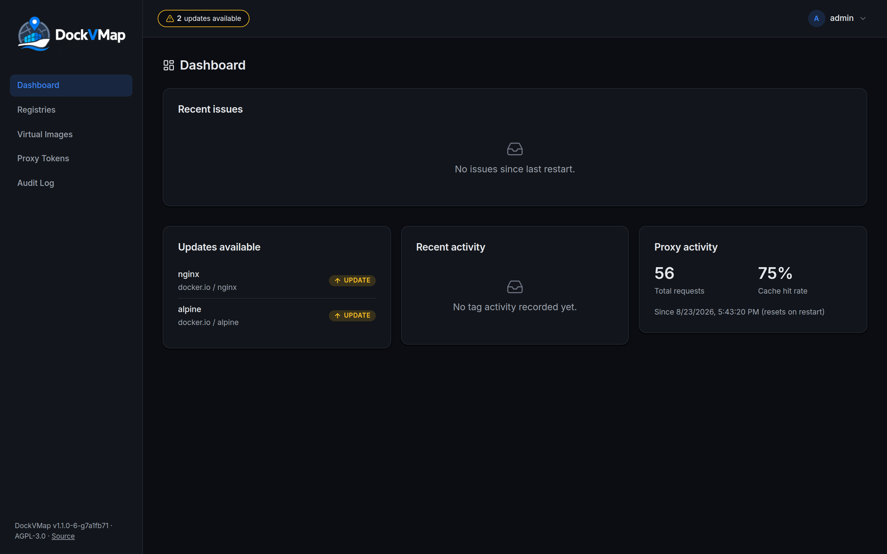
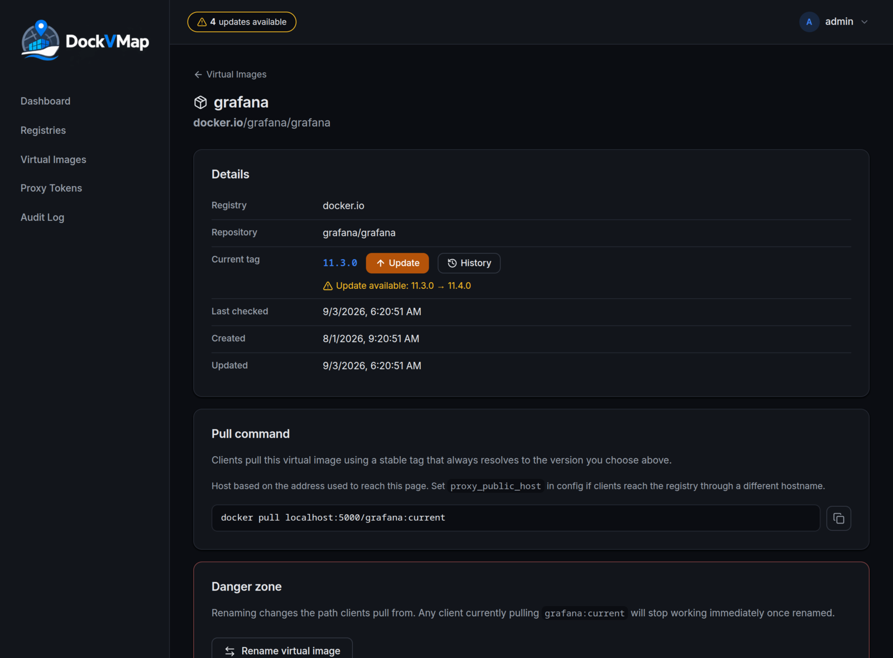

<p align="center">
  
</p>

<h1 align="center">DockVMap</h1>

<p align="center">A self-hosted Docker/OCI registry proxy that gives you a stable tag pointing at a real image version you control.</p>

<p align="center">
  <a href="LICENSE"></a>
  
  
</p>

---

## What it is

DockVMap sits between your Docker clients and a real registry (Docker Hub, GHCR, a private registry — anything speaking the OCI Distribution API). You point clients at a **virtual tag**, e.g.:

```
docker pull registry.internal:5000/myimage:current
```

`current` isn't a real tag on the upstream registry — it's a pointer DockVMap maintains. Behind it, you track a real upstream tag (`myimage:1.4.2`, say) per image, and change what `current` resolves to whenever *you* decide to, from a web UI. Clients never change what they pull; you change what they get.

### Why

`:latest` moves under you with no warning and no audit trail. Hardcoding a specific version tag everywhere it's referenced means every rollout is a find-and-replace across configs. DockVMap adds one layer of indirection so you get a fixed, predictable reference for clients *and* full control over what it actually resolves to — plus a record of when it changed and to what.

## Screenshots

<p align="center">
  
</p>

<p align="center">
  
</p>

## Features

- **Virtual tag proxying** — OCI Distribution API proxy (`/v2/...`) that transparently resolves a stable tag to whatever real tag an image is currently pinned to.
- **Tag family analysis** — inspects a repository's real tags, groups them into families, and tells you when a newer tag in the same family becomes available.
- **Web UI** — Svelte SPA for managing registries, virtual images, and reviewing what changed and when.
- **Notifications** — email (SMTP) and/or generic webhooks when a tracked image's tags change.
- **Optional blob cache** — on-disk manifest/blob cache keyed by digest, to cut repeated upstream pulls.
- **Login rate limiting** — configurable per-IP lockout on the web UI's login, with a trusted-proxies-aware IP resolution so it works correctly behind a reverse proxy.
- **Proxy authentication** — optional HTTP Basic Auth (via issued tokens) in front of the registry proxy itself.
- **Audit log** — every state-changing action recorded, with resolved client IP and actor.

## How it runs

One binary, one SQLite database, three things running inside it:

- a **proxy server** implementing the OCI Distribution API,
- a **web server** serving the REST management API and the embedded frontend,
- a **background worker** doing tag refresh, notifications, and cleanup on independent schedules.

## Quick start

Requires Go 1.25+ and Node.js for the frontend build.

```bash
git clone <this-repo>
cd dockvmap
make build          # builds the frontend, embeds it, builds bin/dockvmap
cp config.sample.yaml data/config.yaml
```

Generate a credential encryption key (needed before you can add any registry that requires auth):

```bash
openssl rand -base64 32
```

Put the result in `credential_encryption_key` in your config, then run:

```bash
./bin/dockvmap -config data/config.yaml
```

Open the web UI (`web_server_listen`, `:8080` by default) — the first visit walks you through creating the initial admin account. Point Docker clients at the proxy port (`proxy_server_listen`, `:5000` by default).

> A plain `go build ./...` will fail on a fresh checkout — the web server embeds `frontend/dist` at compile time, and that directory isn't committed. `make build` (or `make build-frontend` once) handles it.

## Configuration

Settings can come from a YAML file (`config.sample.yaml` is a documented starting point), from `DOCKVMAP_*` environment variables, or both — the config file is entirely optional. Precedence per setting is **env var > config file > built-in default**. Env var names mirror the YAML keys, uppercased with underscores, prefixed `DOCKVMAP_` (e.g. `web_server_listen` → `DOCKVMAP_WEB_SERVER_LISTEN`, `smtp.host` → `DOCKVMAP_SMTP_HOST`); comma-separate list values (`DOCKVMAP_TRUSTED_PROXIES=10.0.0.0/8,192.168.1.1`).

Key options:

| Key | Purpose |
|---|---|
| `data_path` | Where the SQLite database lives |
| `credential_encryption_key` | Base64, 32-byte AES-GCM key encrypting stored registry credentials. If left unset, DockVMap generates one and persists it at `<data_path>/credential_encryption.key` on first run |
| `virtual_tag` | The tag name clients pull (`current` by default) |
| `tags_check_interval` | How often DockVMap polls upstream registries for tag changes |
| `session_lifetime` | Web UI session duration |
| `secure_cookies` | Set `true` once served over HTTPS — otherwise the session cookie is sent unencrypted. Defaults to `true` when `tls.enabled` is true, `false` otherwise |
| `trusted_proxies` | CIDRs/IPs of reverse proxies you trust to report the real client IP |
| `tls` | Serve both the proxy and web servers directly over HTTPS using `cert_file`/`key_file`. If enabled but either file path is blank, TLS is silently disabled at startup |
| `login_rate_limit` | Failed-login lockout: attempts, window, IPs allowed to bypass it |
| `blob_cache` | Optional on-disk cache for manifests/blobs |
| `smtp` / `webhooks` | Notification channels for tag changes |
| `proxy_auth` | Gate the registry proxy itself behind issued Basic Auth tokens |

## CLI

```
dockvmap -config <path>              # path to config file (optional; default: config.yaml)
dockvmap -reset-password <username>  # generate and print a new password, invalidate their sessions, exit
dockvmap -version                    # print version and exit
```

## Development

```bash
make help    # list all targets
make dev     # backend (go run) + frontend (vite dev server) together
make test    # go test ./...
make check   # frontend svelte-check + tsc
make lint    # gofmt + go vet (+ golangci-lint if installed)
```

## License

AGPL-3.0 — see [LICENSE](LICENSE). You're free to use, modify, and self-host this. If you run a modified version as a network service, you're required to make that modified source available to its users — that's the one condition of this license.
