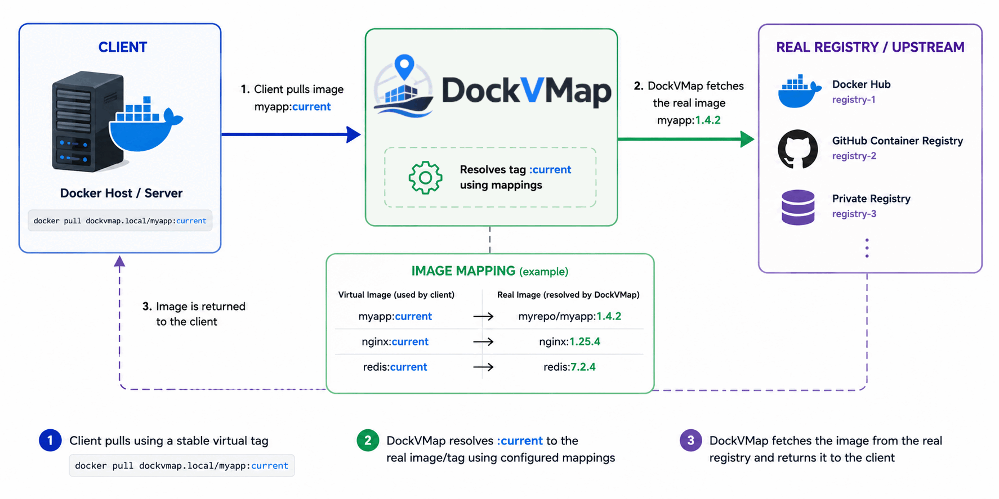

<p align="center">
  
</p>

<h1 align="center">DockVMap</h1>

<p align="center">A self-hosted Docker/OCI registry proxy that gives you a stable tag pointing at a real image version you control.</p>

<p align="center">
  <a href="LICENSE"></a>
  
  
</p>

---

## What it is

DockVMap sits between your Docker clients and a real registry (Docker Hub, GHCR, a private registry, or anything speaking the OCI Distribution API). You point clients at a **virtual tag**, e.g.:

```
docker pull registry.internal:5000/myimage:current
```

`current` isn't a real tag on the upstream registry. It's a pointer DockVMap maintains. Behind it, you track a real upstream tag (`myimage:1.4.2`, say) per image, and change what `current` resolves to whenever *you* decide to, from a web UI. Clients never change what they pull; you change what they get.

<p align="center">
  
</p>

### Why

`:latest` moves under you with no warning and no audit trail. Hardcoding a specific version tag everywhere it's referenced means every rollout is a find-and-replace across configs. DockVMap adds one layer of indirection so you get a fixed, predictable reference for clients *and* full control over what it actually resolves to, plus a record of when it changed and to what.

## Screenshots

<p align="center">
  
</p>

<p align="center">
  
</p>

## Features

- **Virtual tag proxying**: OCI Distribution API proxy (`/v2/...`) that transparently resolves a stable tag to whatever real tag an image is currently pinned to.
- **Tag family analysis**: inspects a repository's real tags, groups them into families, and tells you when a newer tag in the same family becomes available.
- **Tag discovery**: when adding a virtual image, scans the upstream repository in the background (result cached) so you pick from its real tags instead of typing one blind.
- **Tag history**: per-image record of every real tag the virtual tag has resolved to, and when each change happened.
- **Web UI**: Svelte SPA for managing registries, virtual images, and reviewing what changed and when.
- **Notifications**: email (SMTP) and/or generic webhooks when a tracked image's tags change. Email volume is selectable per account (every tag change / only when an upgrade becomes available / off); webhooks always fire and carry an `updateAvailable` flag.
- **Optional blob cache**: on-disk manifest/blob cache keyed by digest, to cut repeated upstream pulls.
- **Login rate limiting**: configurable per-IP lockout on the web UI's login, with a trusted-proxies-aware IP resolution so it works correctly behind a reverse proxy.
- **Proxy authentication**: optional HTTP Basic Auth (via issued tokens) in front of the registry proxy itself.
- **Audit log**: every state-changing action recorded, with resolved client IP and actor.

## How it runs

One binary, one SQLite database, three things running inside it:

- a **proxy server** implementing the OCI Distribution API,
- a **web server** serving the REST management API and the embedded frontend,
- a **background worker** doing tag refresh, notifications, and cleanup on independent schedules.

## Quick start

Requires Go 1.25+ and Node.js for the frontend build.

```bash
git clone <this-repo>
cd dockvmap
make build          # builds the frontend, embeds it, builds bin/dockvmap
cp config.sample.yaml data/config.yaml
```

Generate a credential encryption key (needed before you can add any registry that requires auth):

```bash
openssl rand -base64 32
```

Put the result in `credential_encryption_key` in your config, then run:

```bash
./bin/dockvmap -config data/config.yaml
```

Open the web UI (`web_server_listen`, `:8080` by default). The first visit walks you through creating the initial admin account. Point Docker clients at the proxy port (`proxy_server_listen`, `:5000` by default).

> A plain `go build ./...` will fail on a fresh checkout: the web server embeds `frontend/dist` at compile time, and that directory isn't committed. `make build` (or `make build-frontend` once) handles it.

## Configuration

Settings can come from a YAML file (`config.sample.yaml` is a documented starting point), from `DOCKVMAP_*` environment variables, or both (the config file is entirely optional). Precedence per setting is **env var > config file > built-in default**. Env var names mirror the YAML keys, uppercased with underscores, prefixed `DOCKVMAP_` (e.g. `web_server_listen` → `DOCKVMAP_WEB_SERVER_LISTEN`, `smtp.host` → `DOCKVMAP_SMTP_HOST`); comma-separate list values (`DOCKVMAP_TRUSTED_PROXIES=10.0.0.0/8,192.168.1.1`). Omitting `-config` entirely is fine (runs on env vars/defaults); pointing it at a path that doesn't exist is a startup error, not a silent fallback.

One setting sits outside this system, as a CLI flag instead of a config key: `-data-path` (see CLI below). Where the database and credential key live is a deployment decision fixed at startup, not something meant to be layered through env/file/default like a behavioral setting.

Key options:

| Key | Purpose |
|---|---|
| `logs_path` | Directory for log files. Logs to stdout only if unset |
| `tag_filters_path` | Path to a `filters.yaml` policy file (see Tag filtering below). If set, the file must exist — an invalid path is a startup error, not a silent fallback. Unset uses the built-in default filters |
| `credential_encryption_key` | Base64, 32-byte AES-GCM key encrypting stored registry credentials. If left unset, DockVMap generates one and persists it at `<data_path>/credential_encryption.key` on first run |
| `virtual_tag` | The tag name clients pull (`current` by default) |
| `tags_check_interval` | Minimum time between upstream tag-change polls. The last poll time is persisted, so restarts don't reset the interval |
| `tag_discovery_ttl` | How long a repository's discovered tag list (shown when adding a virtual image) is cached before a "Check repository" click refreshes it in the background |
| `session_lifetime` | Web UI session duration |
| `secure_cookies` | Set `true` once served over HTTPS; otherwise the session cookie is sent unencrypted. Defaults to `true` when `tls.enabled` is true, `false` otherwise |
| `trusted_proxies` | CIDRs/IPs of reverse proxies you trust to report the real client IP. Include `gateway` (e.g. `DOCKVMAP_TRUSTED_PROXIES=gateway` or `trusted_proxies: ["gateway", "10.20.45.23"]`) to resolve the container's IPv4 default gateway at startup — the address Docker SNATs a proxy's traffic to when reaching a published port |
| `tls` | Serve both the proxy and web servers directly over HTTPS using `cert_file`/`key_file`. If enabled but either file path is blank, TLS is silently disabled at startup |
| `login_rate_limit` | Failed-login lockout: attempts, window, IPs allowed to bypass it |
| `blob_cache` | Optional on-disk cache for manifests/blobs, always stored at `<data_path>/cache` |
| `smtp` / `webhooks` | Notification channels for tag changes |
| `proxy_auth` | Gate the registry proxy itself behind issued Basic Auth tokens |
| `proxy_public_host` | Hostname clients use to reach the proxy, shown in the GUI's pull instructions; may include a port (`registry.example.com:5050`) to override `proxy_server_listen`'s port too, e.g. when the publicly reachable port differs from the internal bind port. If unset, the GUI guesses the host from the browser's request host, which can be wrong behind a reverse proxy |

## Tag filtering

Tags fetched from upstream registries can be excluded from tracking/categorization before DockVMap groups them into families. This is useful for CI-generated tags (`commit-<sha>`, `pr-<n>`, etc.) that would otherwise pollute the tag list. This is separate content from the rest of `config.yaml`: it's policy, not runtime configuration, and lives in its own YAML file, referenced by the `tag_filters_path` setting.

```yaml
tag_filters:
  exclude:
    - "^commit-.*"
    - "^pr-.*"
```

Each entry is a regular expression matched against the raw tag name; any match excludes the tag. The snippet above just shows the format — a set of default patterns (CI commit/PR tags, cosign signature artifacts) ships compiled into the binary and is used whenever `tag_filters_path` is unset, so filtering works out of the box with no setup. See `internal/tagfilter/filters.yaml` for the current default list. To customize it, write your own `filters.yaml` somewhere and point `tag_filters_path` at it — the file must exist at that point, or startup fails with an error rather than silently using the built-in default. Your file's `exclude` list fully replaces the built-in one (it isn't merged), so include the defaults yourself if you want to keep them alongside your own patterns. An empty `exclude` list disables filtering entirely.

## CLI

```
dockvmap -config <path>              # path to config file (optional; falls back to DOCKVMAP_* env vars and defaults if unset)
dockvmap -data-path <path>           # path to the data directory: SQLite database, blob cache, credential key (optional)
dockvmap -reset-password <username>  # generate and print a new password, invalidate their sessions, exit
dockvmap -refresh-tags               # refresh tags for all configured images from their upstream registries, exit
dockvmap -backup <path>              # write a consistent copy of the database to <path>, exit
dockvmap -version                    # print version and exit
```

### Backup and restore

`-backup` writes a consistent snapshot of the SQLite database (`VACUUM INTO`) and works while dockvmap is running; the target path must not already exist. It opens the database read-only and does not run migrations, so it snapshots the schema exactly as it stands — to capture the *pre-upgrade* state, run `-backup` with your **current** binary before deploying a new one. It backs up **the database only**. A full restore also needs the credential encryption key — the file at `<data-path>/credential_encryption.key` (or, if you set `credential_encryption_key` in config, that value) — without which stored registry credentials cannot be decrypted; `config.yaml` is likewise your own to keep. The blob cache is regenerable and is not backed up.

To restore: stop dockvmap, put the backed-up file at `<data-path>/dockvmap.db`, restore the credential key, and start dockvmap with a binary of the same version or newer (an older binary refuses to run against a newer schema).

## Development

```bash
make help    # list all targets
make dev     # backend (go run) + frontend (vite dev server) together
make test    # go test ./...
make check   # frontend svelte-check + tsc
make lint    # gofmt + go vet (+ golangci-lint if installed)
```

## License

AGPL-3.0 (see [LICENSE](LICENSE)). You're free to use, modify, and self-host this. If you run a modified version as a network service, you're required to make that modified source available to its users; that's the one condition of this license.
